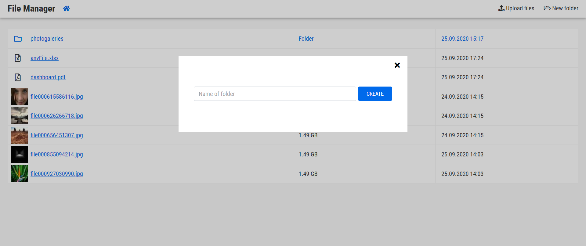

# Filemanager for web application

Simple and intuitive file manager for web application.

What it can really do?
- create directory
- edit / remove file or directory
- upload files by dragging from disk
- possibility of integration into wysiwyg editor

Instalation
-----------

The recommended way to install is via Composer:

```
composer require kevas/filemanager
```

Usage
-----

Create a filemanager content and insert it into your templates.

```php
use Kevas\Filemanager\Filemanager;
$filemanager = new Filemanager;

// Set upload dir relative to your document root
$filemanager->setUploadDir('user_uploads');
$filemanagerContent = $filemanager->render();
```

Set css and js path
```html
<link rel="stylesheet" href="https://cdn.jsdelivr.net/npm/@fortawesome/fontawesome-free@5.14.0/css/all.min.css">
<link rel="stylesheet" href="https://cdn.jsdelivr.net/npm/dropzone@5.7.0/dist/dropzone.min.css">
<link rel="stylesheet" href="https://cdn.jsdelivr.net/gh/kevas/filemanager/src/assets/css/main.css">

<script src="https://cdn.jsdelivr.net/npm/jquery@3.5.1/dist/jquery.min.js"></script>
<script src="https://cdn.jsdelivr.net/npm/dropzone@5.7.2/dist/dropzone.min.js"></script>
<script src="https://cdn.jsdelivr.net/gh/kevas/filemanager/src/assets/js/main.js"></script>
```

Screenshots
-----------




